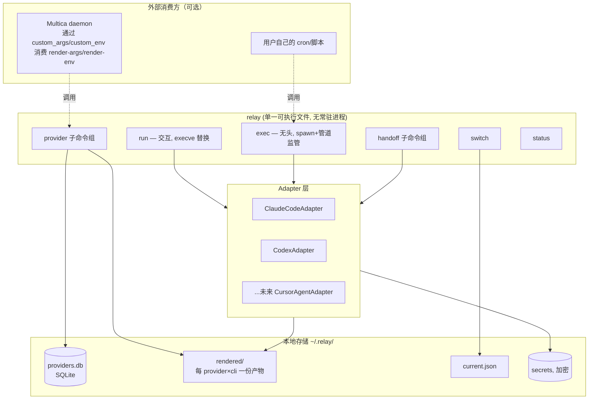

# Relay 技术规格说明书 v0.1

> 一句话定位：Relay 是一个本地优先的命令行工具，负责「用哪个供应商/哪份配置启动哪个 AI Agent CLI」以及「一段会话如何在供应商/CLI 之间语义交接」，不重新实现任务队列/自动重试（那是 Multica 等编排器的职责），但提供干净的集成点供它们调用。

---

## 0. 背景与非目标

### 0.1 要解决的问题（背景）
1. Codex 切 model provider 后无法继续会话（官方 discovery 逻辑按当前激活 provider 过滤，历史数据其实还在）。
2. 跨 Agent CLI（Claude Code ↔ Codex ↔ Cursor Agent 等）没有原生的会话共享机制。
3. 长会话（尤其夹带大量图片）异常中断后，重试会重发整个巨大请求体，容易再次失败；需要能压缩/整理成 Markdown 供新会话续接。
4. 需要在全局默认配置之外，为单个新启动的 CLI 实例临时指定另一个供应商，多实例互不干扰。
5. 无人值守自动重试推进（可选能力，见 §11，参考 mulita-cli.md / Multica 架构）。
6. 自定义通知：toast / webhook（Bark）/ Telegram（可选能力，见 §11）。
7. 任务完成后关机（可选能力，见 §11）。

在讨论过程中确认：**问题 3 的机制基本等价于问题 2 的解法**（统一 Markdown schema + 三级 fallback），因此本 spec 把 2、3 合并成一个子系统（§9 Handoff）。

### 0.2 非目标
- **不做任务队列、不做调度、不做跨任务的自动重试策略。** 这是 Multica 类编排器的职责。Relay 只负责在「某一次启动」这个粒度上把 provider/profile 解析正确，并在被要求时把一次执行的输出/退出码整理成结构化信号，交给外层编排器判断要不要重试。
- **不做跨厂商的会话协议转换。** 不存在能让 Claude Code 的 session 被 Codex 原生 `--resume` 的方法，Relay 不承诺这个能力，只承诺「语义交接」（见 §9）。
- 无人值守重试/通知/关机（§11）作为**可选插件模块**，默认不与核心两大支柱（Provider 层、Handoff 层）耦合。

---

## 1. 核心抽象与术语

| 术语 | 含义 |
|---|---|
| `Provider` | 一个模型供应商的配置（base_url、api_key、model、额外字段），可映射到一个或多个 target CLI（`targets`），对应 cc-switch 的 "universal provider" 概念 |
| `Target CLI` | 被适配的 agent CLI，MVP 覆盖 `claude-code`、`codex`，架构上预留 `cursor-agent` 等 |
| `Adapter` | 每个 target CLI 一个，声明「启动一个 provider 需要几段输入、每段是什么形态」，并实现渲染/校验/spawn 逻辑 |
| `Rendered Artifact` | 由 Adapter 为某个 `(provider, target_cli)` 组合生成的、该 CLI 原生能理解的配置产物（Claude Code 是一份 settings JSON 文件；Codex 是 `config.toml` 里的 `[model_providers.x]`+`[profiles.x]` 片段 + 一个环境变量名） |
| `current` | 全局激活的 provider 指针（每个 target CLI 各自维护一个），`relay switch` 修改它 |
| `Handoff Doc` | 统一 schema 的 Markdown 文档，承载「交接给下一个 agent/CLI」所需的全部语义信息 |

---

## 2. 总体架构



**关键设计原则**：
- Relay 本体无常驻进程；所有状态是本地文件（SQLite + 渲染产物 + 加密密钥库）。
- 全局切换（`switch`）和临时使用（`run`/`exec`）消费**同一份渲染产物**，只是消费方式不同（合并进全局文件 vs 用 flag 直接指向）。
- 明文密钥只在两处短暂存在：内存中、以及即将 spawn 的子进程环境变量表里；不落 argv、不落除 `secrets` 库外的任何文件。

---

## 3. 数据模型

### 3.1 `~/.relay/providers.db`（SQLite）

```sql
CREATE TABLE providers (
    id            TEXT PRIMARY KEY,      -- slug, 如 "my-provider1"
    display_name  TEXT NOT NULL,
    targets       TEXT NOT NULL,         -- JSON 数组: ["claude-code","codex"]
    base_url      TEXT,
    model         TEXT,
    extra_json    TEXT,                  -- 各 CLI 私有字段透传, JSON
    source        TEXT,                  -- "manual" | "cc-switch-import"
    created_at    TEXT,
    updated_at    TEXT
);

CREATE TABLE provider_secrets (
    provider_id   TEXT NOT NULL,
    key_name      TEXT NOT NULL,         -- 如 "api_key"
    ciphertext    BLOB NOT NULL,
    PRIMARY KEY (provider_id, key_name)
);

CREATE TABLE import_log (
    id            INTEGER PRIMARY KEY AUTOINCREMENT,
    source        TEXT,                  -- "cc-switch"
    file_hash     TEXT,
    imported_at   TEXT,
    raw_snapshot  TEXT                   -- 原始 mcp_servers/prompts 表内容，先存起来不解析
);
```

密钥加密：MVP 用操作系统 keychain（macOS Keychain / Linux libsecret，通过成熟库调用）；无 keychain 环境下退化为本地对称加密（密钥派生自机器 ID + 用户口令，首次运行时提示设置）。**绝不使用可逆的简单混淆代替加密。**

### 3.2 `~/.relay/rendered/<target_cli>/<provider_id>.*`
每个 Adapter 决定自己的产物格式：
- `rendered/claude-code/<provider_id>.json` — 完整 Claude Code settings 片段（含 `env` 块）
- `rendered/codex/<provider_id>.toml.fragment` — 待合并进 `~/.codex/config.toml` 的 `[model_providers.x]`/`[profiles.x]` 片段（本身不含明文密钥，只含 `env_key = "RELAY_<PROVIDER_ID>_KEY"`）

### 3.3 `~/.relay/current.json`
```json
{
  "claude-code": "my-provider1",
  "codex": "my-provider2"
}
```
每个 target CLI 独立维护当前全局 provider，`switch` 只改动指定 target 那一项。

---

## 4. 命令行接口规格

```
relay provider import --from cc-switch <file.sql> [--dry-run]
relay provider list [--target <cli>]
relay provider add --id <id> --target <cli>... --base-url <url> --model <m> [--api-key-stdin]
relay provider remove <id>
relay provider render-args <cli> <provider_id>      # 输出该 CLI 需要的 argv 片段(JSON 数组), 给 Multica custom_args 用
relay provider render-env  <cli> <provider_id>      # 输出该 CLI 需要的 env 片段(KEY=VALUE 逐行), 给 Multica custom_env-file 用

relay switch <provider_id> [--target <cli>]         # 改全局默认；不指定 --target 则对 provider.targets 里所有 target 都切
relay status                                        # 展示每个 target 当前 provider + 正在运行的 relay 管理的实例列表

relay run  <cli> [--provider <id>] [-- <原生参数...>]   # 交互模式
relay exec <cli> [--provider <id>] [-- <原生参数...>]   # 无头/受监管模式

relay handoff export  [--session <id>] --cli <cli> [--live | --dead] [-o <path>]
relay handoff continue --doc <path> --cli <cli> [--provider <id>]
relay handoff schema                                # 打印/校验 Handoff Doc 的 JSON Schema，供 Skill 引用
relay skill install [--cli claude-code,codex]        # 默认探测本机 CLI；显式指定时可提前离线安装
relay --version                                    # 发布版本；go install 读取模块构建版本
```

退出码约定（供 `exec` 和外层编排器消费，见 §8.3）：`0` 成功；`10` 可重试的基础设施错误；`11` 检测到需要人类介入（如触发了 AskUserQuestion 类工具）；`12` 会话历史损坏需要冷启动重试；其余非零为未分类错误。

---

## 5. Adapter 契约

```ts
interface LaunchAdapter {
  // 渲染阶段：导入/新增 provider 时调用一次，产出 Rendered Artifact
  render(provider: Provider): RenderedArtifact;

  // 全局切换：把 Rendered Artifact 合并进该 CLI 的全局原生配置文件
  applyGlobal(artifact: RenderedArtifact): void;

  // 临时启动：返回本次 spawn 需要的 argv 片段 + env 片段，不落盘、不改全局文件
  buildLaunchInputs(artifact: RenderedArtifact, secrets: ResolvedSecrets): {
    argv: string[];
    env: Record<string,string>;
  };

  // 会话恢复所需的原生 flag，供 exec 模式和 Handoff 三级 fallback 第 2 层使用
  resumeArgs(sessionId: string): string[];

  // 安装随二进制内嵌的交接 Skill；targetDir 为 relay-handoff 目录
  installSkill(targetDir: string): void;
}
```

Go 接口对应 `InstallSkill(targetDir string) error`（概念契约 `installSkill(targetDir string) error`）。Claude Code 和 Codex Adapter 分别实现。默认写入 `~/.claude/skills/relay-handoff/SKILL.md` 和 `~/.codex/skills/relay-handoff/SKILL.md`；分别遵循 `CLAUDE_CONFIG_DIR` 与 `CODEX_HOME`。不依赖网络、供应商配置或凭据库。相同内容重复安装不产生重复副本；Relay 管理且未经手改的内容可升级，遇到用户修改或同名手动文件时保留并明确报错。

### 5.1 ClaudeCodeAdapter（一段式）
- `render()` 产出 settings JSON，包含非敏感 `env`（`ANTHROPIC_BASE_URL`/`ANTHROPIC_MODEL` 等）、`permissions`、`model` 等受支持字段；鉴权凭据不写入配置。另生成随二进制内嵌的 Handoff 插件。
- `applyGlobal()`：按 Claude Code 的 settings 合并优先级，把内容写入 `~/.claude/settings.json`（保留其余用户已有 key，只覆盖 Relay 管理的字段，用注释/标记块界定 Relay 管理范围，避免覆盖用户手工添加的其他配置）。
- `buildLaunchInputs()`：使用 `--setting-sources "" --settings <rendered_file_path>` 隔离供应商设置，密钥仅注入子进程环境。实测空 setting-sources 同时关闭用户 Skill，因此通过 `--plugin-dir <Relay生成的handoff-plugin目录>` 显式加载自带 Handoff，插件命令为 `/relay:relay-handoff`；不重新启用全局 settings 或其他用户插件。依据见 Claude Code `NOTES.md`。
- `resumeArgs(id)`：`["--resume", id]`。

### 5.2 CodexAdapter（两段式，务必分离 argv 与 env）
- `render()` 产出：
  - `config.toml` 片段：`[model_providers.<id>]`（`base_url`、`env_key = "RELAY_<ID>_KEY"`，**不含明文**）+ `[profiles.<id>]`（`model_provider`、`model`）。
  - 记录该 provider 密钥应绑定的 env 变量名 `RELAY_<ID>_KEY`（大写、下划线，避免与用户已有变量冲突）。
- `applyGlobal()`：把 `[model_providers.<id>]`/`[profiles.<id>]` 合并进 `~/.codex/config.toml`，用可识别的注释块标出 Relay 管理的 section，不覆盖用户手工维护的其他 profile；同时把顶层 `model`/`model_provider` 指针改成这个 profile（全局切换语义）。
- `buildLaunchInputs()`：`argv = ["--profile", id]` 或 `["-c", "model_provider=" + id]`（二选一，实现时先探测当前 Codex 版本更推荐哪种，写成配置项而非硬编码），`env = { "RELAY_<ID>_KEY": <明文密钥> }`。
- **必须验证** `RELAY_<ID>_KEY` 出现在 Codex 自己的 `shell_environment_policy`/env allowlist 里；若 Codex 版本要求显式声明允许的变量名前缀，Adapter 需要在 `applyGlobal()`/`buildLaunchInputs()` 时一并写入/检测这条配置，并在集成测试里覆盖「设置了变量但 Codex 读不到」这个已知坑。
- `resumeArgs(id)`：视 Codex 当前版本的 resume 子命令语法而定（`exec resume <id>` 或 `--resume <id>`），实现前需在目标 Codex 版本上验证一次，不要假设语法长期不变。

### 5.3 密钥永不进入 argv
两个 Adapter 都必须保证：明文密钥不会出现在任何进程的 argv 里（`ps`/`/proc/<pid>/cmdline` 可见），不写配置文件，只能经子进程环境变量注入；仅明确调用 `render-env` 时输出。配置产物仍使用私有权限。

---

## 6. `provider import --from cc-switch` 详细设计

依据已确认的事实：导出文件是**纯 SQL dump**，非 JSON，文件名 `cc-switch-export-{timestamp}.sql`，内容是多表 `INSERT INTO` 语句，开头有 `CC_SWITCH_SQL_EXPORT_HEADER` 校验头。

**实现步骤（严格按此顺序，不要用正则解析 INSERT 语句代替第 2/3 步）**：
1. 读取文件前 N 字节，校验是否包含 `CC_SWITCH_SQL_EXPORT_HEADER` 标记；不匹配则报错拒绝导入（防止误吃到无关 .sql 文件）。
2. 在内存 SQLite（或临时文件 SQLite）中执行整份脚本，重建出临时数据库。
3. 执行 `SELECT id, app_type, name, settings_config, meta, is_current FROM providers;`（列名以实际 schema 为准，若与本 spec 假设不符，以运行时探测到的列为准，不要硬编码假设失败即报错并打印实际列名供人工确认）。
4. 对每一行：
   - `app_type` → 映射到 Relay 的 `targets`（`claude` → `claude-code`，`codex` → `codex`，`gemini` 等未支持的 target 先原样记录、不生成 Adapter 产物，避免静默丢数据）。
   - `settings_config`（JSON 字符串）反序列化，提取 `base_url`/`api_key`/`model` 等字段写入 `providers` 表 + `provider_secrets` 表（密钥立刻加密存储，不落中间文件）。
   - `name` → `display_name`；`id` 若与本地已有冲突，加后缀 `-imported-N` 并在导入报告里列出，不静默覆盖。
5. `mcp_servers`/`prompts` 表原样存入 `import_log.raw_snapshot`，本版本不解析、不生成对应能力，为后续需要时保留原始数据。
6. `is_current` 为真的行：仅在导入报告里提示"cc-switch 中原激活的 provider 是 X，是否要 `relay switch X`"，**不自动执行 switch**。
7. `--dry-run`：只做到第 4 步的解析结果展示，不写入 `providers.db`。

---

## 7. `run` / `exec` 进程模型

### 7.1 `relay run <cli> [--provider <id>] [-- ...]`
- 解析 provider（未指定则用 `current.json` 里该 target 的全局默认，行为等价于「不改变用户平时习惯，只是套了层壳」）。
- 调用对应 Adapter 的 `buildLaunchInputs()` 得到 argv 片段 + env 片段。
- 用 `execve`（或所在语言的等价原语，如 Go 的 `syscall.Exec`）**替换当前进程**，把真实 CLI 二进制、拼接好的完整 argv（用户自己追加在 `--` 之后的参数原样透传在后面）、叠加好的 env 一次性传入。Relay 进程本身在这一刻消失，终端 TTY、Ctrl-C、方向键、TUI 渲染全部由真实 CLI 原生处理，无中间层开销和干扰。
- **不做**任何 stdout 解析、不做重试、不写日志到 stream-json（这些是 `exec` 模式的职责）。

### 7.2 `relay exec <cli> [--provider <id>] [-- ...]`
- 同样先解析 provider、拿到 launch inputs。
- 强制在 argv 里补齐无头模式必需的 flag（`-p`/`exec` + `--output-format stream-json` 等，具体值由 Adapter 提供，Relay 核心不硬编码某个 CLI 的 flag 名）。
- `spawn` 子进程（非 exec 替换），把 stdout 通过管道接到内部解析器：
  - 实时解析 stream-json，识别 `session_id` 并持久化（写入 `~/.relay/sessions/<cli>/<session_id>.meta.json`，记录 provider、work_dir、启动时间，供 Handoff 子系统的三级 fallback 第 2 层使用）。
  - 识别错误分类（复用/移植 mulita-cli.md 里 `classify.go` 的思路：正则匹配 `stream disconnected`/`connection closed`/`i/o timeout` 等归为可重试网络错误；`UnresumableHistory`/`ResumeRejected` 归为「需要冷启动重试」）。
  - 检测到 agent 触发了「向人类提问」类工具（如 `AskUserQuestion`）时，标记为「需要人类介入」，不自动回答、不自动假设答案。
- 进程退出后，按 §4 约定的退出码规范返回，供调用方（用户自己的脚本、Multica、或 Relay 未来可选的重试插件）判断下一步。
- **本命令自身不做重试循环**——重试逻辑是 §11 可选插件或外层编排器的职责；`exec` 只负责「跑一次、分类结果、返回结构化信号」。

### 7.3 TTY 自动探测作为兜底
除了显式的 `run`/`exec` 子命令外，保留一个内部工具函数「探测 stdin/stdout 是否附着 TTY」，用于：(a) 在用户误用 `exec` 但实际在交互终端里跑时给出提示（"检测到交互终端，是否改用 `relay run`？"）；(b) 未来若要支持单一入口自动分流，这个探测逻辑已经就绪。MVP 阶段不做自动切换，只做提示，避免探测出错导致行为混乱。

---

## 8. Handoff 子系统

### 8.1 统一 Schema（跨 CLI 的唯一契约）
Handoff Doc 是一份 Markdown 文件，但**必须包含以下固定结构**（用于机器可靠解析 + 人类可读）：

```markdown
---
schema_version: 1
source_cli: claude-code
source_provider: my-provider1
source_session_id: <id, 若有>
generated_by: live-agent | dead-session-resume | raw-file-fallback
generated_at: <ISO8601>
git:
  work_dir: /path/to/worktree
  branch: feature/xxx
  head_commit: <sha>
  dirty: true
---

## 目标
...

## 已完成
- ...

## 进行中 / 当前状态
- ...

## 关键决策
- ...

## 文件与代码状态
- 修改过的文件列表 + 一句话说明
- 未提交改动摘要

## 硬约束（不可压缩，必须原样保留）
- 用户明确给过的、不能被摘要丢失的强制性指令

## 环境依赖声明
- 本会话用到的能力（MCP server、特定工具、特定权限模式），目标 CLI 可能不支持，请核实

## 下一步计划
- ...
```
front-matter 里的字段是机器读取的元数据；正文各节标题固定，方便下游用简单的 Markdown 解析器（不需要完整 AST）按节提取。「硬约束」这一节存在的意义是防止摘要压缩时把用户明确说过的强制性要求（如"不要用某个库"）当作普通上下文丢弃。

### 8.2 生成路径：三级 Fallback

**第 1 级 — 活 agent 对话（首选，保真度最高）**
- 通过一个标准触发词/斜杠命令（如 `/handoff`）或对应 CLI 的 Skill 机制，让当前正在运行、仍持有完整上下文（含未落盘的中间推理）的 agent 自己按 §8.1 schema 输出。
- 实现为一个 Skill（`SKILL.md` + 触发描述），理由：复用当前 agent 已在内存里的上下文，比事后重新解析日志文件保真度更高；且声明式的 Skill 比写死在 Relay 代码里的 prompt 更容易迭代、不需要重新发版 Relay 本体。
- Codex 原生支持 `SKILL.md` 格式（[OpenAI 官方 Agent Skills 文档](https://developers.openai.com/codex/skills/)），格式见 [Agent Skills specification](https://agentskills.io/specification)。当前官方文档推荐用户路径 `~/.agents/skills`；本项目按指定路径使用 `$CODEX_HOME/skills`（默认 `~/.codex/skills`），已在 Codex 0.154.0 的 `skills/list` 中实测仍原生加载，见 Codex `NOTES.md`。这不是未解决的开放问题。
- Skill 内容通过 Go embed 随单一二进制分发。`relay skill install [--cli claude-code,codex]` 默认只为 PATH 或 `RELAY_*_BIN` 可探测到的 CLI 安装；不会执行 CLI 探测，也不会安装目标 CLI 本体。显式 `--cli` 可以在目标 CLI 尚未安装时提前部署。没有探测到目标时给出后续操作提示并成功退出。
- 两端一行安装器末尾默认运行一次 `relay skill install`；Homebrew/Scoop 使用安装后钩子。手动下载或 `go install` 后保留独立子命令。`relay handoff schema` 提供当前 schema；Skill 升级随 Relay 更新，用户手动修改受保护。

**第 2 级 — agent 已退出，但会话未损坏 → 无头 resume 后触发同一个 Skill**
- 不直接解析本地会话文件（官方文档明确这类文件格式属于内部实现细节、版本间会变，自建解析器脆弱）。
- 优先用官方支持的方式重新拉起：`relay exec <cli> --provider <上次的 provider> -- --resume <session_id> "<触发 handoff skill 的一句话>"`；Codex 若有更结构化的读取接口（如 App Server 的 `thread/read`/`thread/items/list`），Adapter 应优先调用这类接口而非重新起模型对话，成本更低、更稳定。
- 输出同样落到 §8.1 schema，`generated_by: dead-session-resume`。

**第 3 级 — resume 失败（历史损坏/凭据过期等）→ 兜底直接解析本地文件**
- 这一步没有可对话的 agent，必须是 Relay 自己的代码，不是 Skill。
- 需要**容错解析**（参考社区已有的 `claude-session-parser`/`fix-jsonl` 之类项目处理巨大 thinking 块、截断文件、格式版本差异的思路，不要求逐字段完整解析，只要能抽取「用户消息 + 助手最终回复 + 工具调用摘要」这条主干）。
- 解析出的原始事件流交给任意一个可用模型做一次性总结，仍按 §8.1 schema 输出，`generated_by: raw-file-fallback`，并在「环境依赖声明」节额外注明「本文档由降级路径生成，可能存在信息丢失」。

### 8.3 消费路径：`relay handoff continue`
- 读取 Handoff Doc，解析 front-matter 确定目标 provider/CLI（若命令行显式传了 `--cli`/`--provider` 则以命令行为准）。
- 把正文内容作为新会话的首条 user message（或写入目标 CLI 认的项目上下文文件，如 `AGENTS.md`/`CLAUDE.md`，视 Adapter 而定），再调用 `relay run`/`relay exec` 启动。
- 「硬约束」节的内容额外单独强调注入（例如包一层"以下是必须遵守的约束，不可忽略"的前缀），防止模型把它当普通背景信息弱化。

---

## 9. 与 Multica 的集成方式

不要求 Multica 侧改代码，Relay 提供两种松耦合接入点，二选一或并存：

**方式 A：包装二进制**
把 Multica runtime 配置的可执行路径从 `codex`/`claude` 换成：
```
relay exec codex --provider my-provider1 --
```
（Multica 会把它自己的原生参数追加在 `--` 之后，Relay 原样透传）

**方式 B：只做渲染器，产出片段给 Multica 原生字段消费**
```bash
multica agent create --name my-agent --runtime-id codex \
  --custom-args "$(relay provider render-args codex my-provider1)" \
  --custom-env-file <(relay provider render-env codex my-provider1)
```
`render-env` 输出的内容必须只在这次调用的生命周期内存在（管道/进程替换语法 `<(...)`），不落临时文件；若目标环境不支持进程替换语法，退化为 `--custom-env-file` 指向一个权限 `0600` 的临时文件，写完立即在同一脚本里 `shred`/删除。

方式 B 更松耦合，推荐作为默认集成方式；方式 A 适合完全不想碰 Multica 配置、只想换个二进制路径的场景。

---

## 10. 安全要求汇总（贯穿全 spec，此处集中列出供实现自检）
1. 明文密钥只允许出现在：`provider_secrets` 表的加密列、即将 spawn 的子进程环境变量表。**不允许**出现在：任何 argv、任何日志输出、Handoff Doc、`render-args` 的输出。
2. `render-env` 的输出本身包含明文（因为下游就是要拿它当 env 用），文档要显式警告调用方"这是敏感输出，不要打印到共享终端/CI 日志"。
3. Codex 的 `config.toml` 片段只写 `env_key`（变量名），不写明文；Claude Code settings 也不写鉴权凭据，凭据由进程环境注入。配置文件使用 `0600`（Windows 对应用户 ACL）。
4. `import_log.raw_snapshot` 里如果 cc-switch 的 `mcp_servers` 表包含凭据（部分 MCP server 配置会带 token），也要在存储前做加密，不能因为「本版本不解析它」就当作普通数据明文存放。
5. 所有对外部文件系统路径的操作（尤其是 Handoff Doc 读取、cc-switch 导入文件读取）要做路径校验，防止路径穿越。

---

## 11. 可选插件模块（不在 MVP 范围，接口预留即可）
- **无人值守重试**：复用 §7.2 `exec` 已经吐出的分类结果（可重试/需人工/冷启动重试）驱动一个简单的本地循环（无需数据库事务，单机场景用文件锁 + 状态文件足够），仅在用户未接入 Multica 时启用。
- **通知**：定义 `NotificationEvent { type: task_completed|task_failed|needs_human|retry_exhausted, payload }`，适配器模式接 Bark（简单 HTTP GET/POST）、Telegram Bot API、任意 webhook。
- **完成后关机**：读取上面无人值守循环的「队列清空」信号触发，默认要求二次确认或可配置的倒计时窗口，倒计时期间通过通知模块提醒。

这三者应作为独立子命令组（如 `relay watch`）存在，允许用户完全不装它们、只用 Provider 层 + Handoff 层。

---

## 12. 实现优先级（建议阶段划分）

| 阶段 | 内容 |
|---|---|
| P0 | 数据模型（§3）+ ClaudeCodeAdapter/CodexAdapter 的 `render`/`buildLaunchInputs`（§5）+ `provider add/list`、`switch`、`run`、`status` |
| P1 | `provider import --from cc-switch`（§6）+ `relay exec` 的 spawn/解析/分类基础版（§7.2，先不含错误分类的完整正则库） |
| P2 | Handoff §9 第 1 级（Skill + 活 agent 对话）+ `handoff continue` |
| P3 | Handoff 第 2/3 级 fallback（无头 resume、原始文件容错解析） |
| P4（可选） | §11 插件模块 |
| P5 | 与 Multica 的两种集成方式（§9）打通并写集成测试 |

---

## 13. 开放问题（实现前需要确认或探测，不要假设）
1. Codex 当前版本 `--profile` 与 `-c model_provider=` 两种方式哪个更被推荐/更稳定，需要在目标 Codex 版本上实测。
2. Codex `shell_environment_policy` 的 allowlist 具体配置语法（需要确认是否需要在 `config.toml` 里显式声明 `RELAY_*` 前缀允许通过）。
3. cc-switch `providers` 表的完整列定义（本 spec 依据的是间接来源，导入器实现时应先做一次 `SELECT * FROM providers LIMIT 1` 打印实际列名核对，再固化字段映射，不要硬编码列顺序）。
4. Claude Code settings 文件的「Relay 管理区块」如何与用户手工编辑的其余内容共存而不冲突，建议用注释标记 + 首次写入前询问用户确认覆盖范围。
5. 是否需要支持 `cursor-agent` 作为 P0/P1 范围内的第三个 Adapter，还是留到后续版本——取决于用户自己的实际使用频率。

---

## 14. 产品分发与一行安装

- 使用 GoReleaser 与 GitHub Actions。在推送 `v*` tag 时，先通过三系统测试、安装器回归和五平台快照检查，再以 `CGO_ENABLED=0` 发布 `linux/amd64`、`linux/arm64`、`darwin/amd64`、`darwin/arm64`、`windows/amd64`。用户不需要 Go、Node、Python 或 SQLite 运行时。
- Unix 产物为 `relay-<os>-<arch>.tar.gz`；Windows 同时提供 `relay-windows-amd64.exe` 和供 Scoop 使用的 zip。Release 附带 `checksums.txt`、两端安装脚本、Homebrew formula、Scoop manifest。
- Linux/macOS 一行入口为 `curl -fsSL https://get.relay.sh | sh`。探测 uname，下载固定 tag 产物、校验 SHA-256 后安装到 `~/.local/bin`（自动创建）；不可写才回退 `/usr/local/bin`，需要 sudo 时提示。持久化 PATH 并提示如何在当前父 shell 生效。
- Windows 一行入口为 `irm https://get.relay.sh/install.ps1 | iex`。下载并校验 amd64 exe，安装为 `%LOCALAPPDATA%\Relay\bin\relay.exe`，更新当前进程与用户 PATH。使用系统环境变量 API，避免 `setx PATH` 的截断问题。
- SHA-256 校验或下载失败不得覆盖现有二进制；通过校验后采用同目录临时文件原子替换。默认运行 Skill 安装；Skill 失败明确返回非零并提示修复命令。
- 支持 `RELAY_VERSION`、`RELAY_INSTALL_DIR`、`RELAY_REPOSITORY`、`RELAY_SKIP_SKILLS`、`RELAY_NO_MODIFY_PATH`，不引入常驻更新器。当前先使用现有私有仓库 `bingame/cli-relay`，`RELAY_DOWNLOAD_MODE=gh` 复用已授权 GitHub CLI 下载；不要求 token 出现在 argv 或配置中。匿名 curl/irm 入口等待公开发行资源，不依赖未准备的域名即可完成私有安装。
- Homebrew 使用 tap formula（包括 Linux），Scoop 先添加 bucket 再 `scoop install relay`。生成和推送由 GoReleaser 完成；软件源仓库与授权 token 必须配置一次。`relay-cli/tap` 需要对应组织和仓库已建立，默认使用实际仓库所有者 `bingame`，可通过 CI Variables 改写。
- Go 开发者可执行 `go install github.com/bingame/cli-relay/cmd/relay@latest`，然后 `relay skill install`。v0.1 不包含 apt/deb 或 winget。
- 公共域名入口和软件源不是本地构建自动获得的资源；公开发行地址、域名 HTTPS 和软件源配置完成后才可宣布一行安装上线。部署资源与准确步骤见 `distribution/NOTES.md`。
