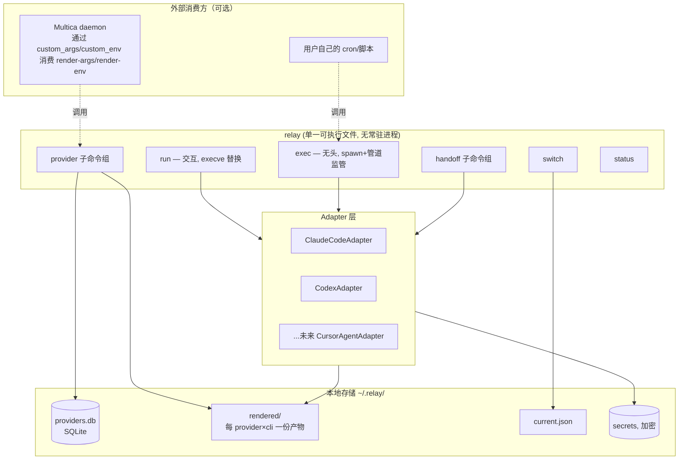

# Relay 技术规格说明书 v0.11

> **v0.11 变更（按真实使用反馈收敛供应商模型与导入冲突语义）**：① Target CLI 名称改为与原生 CLI 一致的 `claude`（原先的 `claude-code` 废弃），下文所有 CLI 标识、渲染目录、`secret get` 等示例均已同步。② **供应商身份由 `(target, id)` 共同决定**：`Provider` 不再持有 `targets` 数组（多 CLI 共用一条记录），改为持有单个 `target`；因此 `providers` 主键从 `(id)` 改为 `(target, id)`，并新增 `UNIQUE(target, display_name)`——**不同 CLI 可同名供应商，同一 CLI 内显示名称唯一**，导入时也不再需要为供应商名追加 CLI 后缀。③ **导入冲突直接覆盖，不再生成 `slugify(display_name-target)` + 数字后缀**：以 `(target, id)` 为匹配键，`source = "manual"` 的记录同样参与覆盖（与 cc-switch 的覆盖行为一致），`conflict_renamed` 信号废弃，用户可放心清库重导，本版不做迁移与向下兼容。④ Claude Code 认证冲突警告：渲染产物与 `BuildLaunchInputs` 同时清除继承的 `ANTHROPIC_AUTH_TOKEN`/`ANTHROPIC_API_KEY`，只保留 `apiKeyHelper` 回调，避免出现「两者并用导致认证优先级混乱」的警告。

> **v0.9 变更（Codex 模型目录实测修正）**：

> 一句话定位：Relay 是一个本地优先的命令行工具，负责「用哪个供应商/哪份配置启动哪个 AI Agent CLI」以及「一段会话如何在供应商/CLI 之间语义交接」，不重新实现任务队列/自动重试（那是 Multica 等编排器的职责），但提供干净的集成点供它们调用。

> **v0.9 变更（Codex 模型目录实测修正）**：§5.2 此前把 `model_catalog_json` 当作"由 `provider_models` 渲染而来的模型列表"一笔带过，实现据此写出 Relay 自拟的 JSON 结构，结果 Codex 0.155.1 直接拒绝启动（`failed to parse model_catalog_json path ...: missing field `slug``）。实测（二进制字符串挖掘 + 本地假服务逐项探针）确认它是 **Codex 自己的完整模型定义目录**：顶层 `{"models": [...]}`，每条必须带 `slug`/`display_name`/`supported_reasoning_levels`/`shell_type`/`visibility`/`supported_in_api`/`priority`/`support_verbosity`/`truncation_policy`/`experimental_supported_tools` 以及 `base_instructions`（或 `model_messages.instructions_template`），且条目是对该 slug 的**替代**而非补充（没有内置继承，漏写提示词就是真没有提示词）。§5.2 现已写明完整条目形态、中性模板来源（与 cc-switch 为第三方模型生成的目录同形）、不声明 freeform 工具（第三方 `/responses` 网关会拒绝 `type=="custom"` 的 `apply_patch`）以及渲染前自检要求。详细实证记录见 `internal/adapter/codex/NOTES.md`。

> **v0.8 变更（回应真实使用反馈）**：① 落地 §6 第 4 步的导入白名单——此前实现把 cc-switch 整条 settings 脱敏后全量塞进 `extra_json`，导致 `provider list` 输出混入 hooks/permissions/statusLine 等运行环境配置，且 ClaudeCodeAdapter 以整份 `claude_settings` 为渲染基底、把这些字段写进渲染产物，与 §6 矛盾。现在导入侧与渲染侧都只消费白名单语义字段（Claude Code 侧 `extra.claude_settings` 仅保留 `env`；Codex 侧 `extra.codex_config` 仅保留 Adapter 消费的 `model_provider`/profile 字段与 `model_providers` 定义内的供应商字段），被剔除的内容仍完整保留在加密的 `source_settings` 快照中。② §4 所有接受供应商的参数同时接受 **ID 或显示名称**（ID 精确匹配优先；名称重名时报错并列出候选 ID），并为这些参数提供 shell 补全（cobra 动态候选）。早期实现（v0.6 之前）把 cc-switch 上游 UUID 直接当作 provider ID 入库的存量数据，覆盖匹配会保留旧 ID（§6 设计），需要清库重导才能拿到友好 slug——这是已知的存量数据边界，不为此新增迁移命令。

> **v0.7 变更（合并在线讨论稿，并以 cc-switch 当前源码复核）**：§6 不再把本 spec 中出现过的 `providers` 列名当成上游契约。实现导入器时，必须直接对照所支持 cc-switch 版本的 `src-tauri/src/database/schema.rs`（必要时连同迁移/导出代码），或者在重建出的临时数据库上执行 `PRAGMA table_info(providers)` 现场探测；查询和字段映射由探测结果生成。早期草稿中的列名、列顺序和示例 `SELECT` 均不得作为实现依据。

> **v0.6 变更（回应实现阶段发现的 spec/代码/README 三方不一致）**：① §6 明确"覆盖匹配"仅限 `source="cc-switch-import"` 的记录，`manual` 记录永远不参与匹配（此前只在"失效清理"一处写了这条原则，未延伸到匹配阶段，是本 spec 的疏漏，现予补齐；代码已实现的行为是对的，不需要改代码）；② 补充 ID 撞号生成规则（`slugify(display_name+"-"+target)` + 数字后缀 `-2/-3...`），废弃此前从未真正采用的占位写法 `-imported-N`（README 中提到的 `-imported-N` 属于文档错误，需在 README 侧单独修正，不是 spec 问题）；③ 补全导入报告的输出 schema，并明确 `conflict_renamed` 是撞号改名的统一信号，不要求区分撞号记录的来源或额外追踪其 ID。

---

## 0. 背景与非目标

### 0.1 要解决的问题（背景）
1. Codex 切 model provider 后无法继续会话（官方 discovery 逻辑按当前激活 provider 过滤，历史数据其实还在）。**补充确认**：跨 provider resume 不只是 discovery 隐藏的问题，Claude Code 官方文档明确指出历史记录里若含有上一个 provider 网关"翻译"过的工具调用格式，换 provider 继续可能触发 400 错误，这类清理只在直连官方 API 时才做——即跨 provider resume 在协议层面本身就有风险，不是"绕开 discovery 就万事大吉"，这进一步印证了 §9 Handoff 机制的必要性（见该节更新）。
2. 跨 Agent CLI（Claude Code ↔ Codex ↔ Cursor Agent 等）没有原生的会话共享机制。
3. 长会话（尤其夹带大量图片）异常中断后，重试会重发整个巨大请求体，容易再次失败；需要能压缩/整理成 Markdown 供新会话续接。
4. 需要在全局默认配置之外，为单个新启动的 CLI 实例临时指定另一个供应商，多实例互不干扰。
5. 无人值守自动重试推进（可选能力，见 §11，参考 mulita-cli.md / Multica 架构）。
6. 自定义通知：toast / webhook（Bark）/ Telegram（可选能力，见 §11）。
7. 任务完成后关机（可选能力，见 §11）。

在讨论过程中确认：**问题 3 的机制基本等价于问题 2 的解法**（统一 Markdown schema + 三级 fallback），因此本 spec 把 2、3 合并成一个子系统（§9 Handoff）。

### 0.2 非目标
- **不做任务队列、不做调度、不做跨任务的自动重试策略。** 这是 Multica 类编排器的职责。Relay 只负责在「某一次启动」这个粒度上把 provider/profile 解析正确，并在被要求时把一次执行的输出/退出码整理成结构化信号，交给外层编排器判断要不要重试。
- **不做跨厂商的会话协议转换。** 不存在能让 Claude Code 的 session 被 Codex 原生 `--resume` 的方法，Relay 不承诺这个能力，只承诺「语义交接」（见 §9）。
- 无人值守重试/通知/关机（§11）作为**可选插件模块**，默认不与核心两大支柱（Provider 层、Handoff 层）耦合。

---

## 1. 核心抽象与术语

| 术语 | 含义 |
|---|---|
| `Provider` | 一个模型供应商的配置（base_url、api_key、model、额外字段），通过 `target` 绑定到单个 target CLI，对应 cc-switch 的 "universal provider" 概念（同一供应商可在不同 target 下各自保存） |
| `Target CLI` | 被适配的 agent CLI，MVP 覆盖 `claude`、`codex`，架构上预留 `cursor-agent` 等 |
| `Adapter` | 每个 target CLI 一个，声明「启动一个 provider 需要几段输入、每段是什么形态」，并实现渲染/校验/spawn 逻辑 |
| `Rendered Artifact` | 由 Adapter 为某个 `(provider, target_cli)` 组合生成的、该 CLI 原生能理解的配置产物（Claude Code 是一份 settings JSON 文件；Codex 是 `config.toml` 里的 `[model_providers.x]`+`[profiles.x]` 片段 + 一个环境变量名） |
| `current` | 全局激活的 provider 指针（每个 target CLI 各自维护一个），`relay switch` 修改它 |
| `Handoff Doc` | 统一 schema 的 Markdown 文档，承载「交接给下一个 agent/CLI」所需的全部语义信息 |

---

## 2. 总体架构



**关键设计原则**：
- Relay 本体无常驻进程；所有状态是本地文件（SQLite + 渲染产物 + 加密密钥库）。
- 全局切换（`switch`）和临时使用（`run`/`exec`）消费**同一份渲染产物**，只是消费方式不同（合并进全局文件 vs 用 flag 直接指向）。
- 明文密钥只在两处短暂存在：内存中、以及即将 spawn 的子进程环境变量表里；不落 argv、不落除 `secrets` 库外的任何文件。

---

## 3. 数据模型

### 3.1 `~/.relay/providers.db`（SQLite）

```sql
CREATE TABLE providers (
    target        TEXT NOT NULL,         -- 所属 CLI: "claude" | "codex" | ...
    id            TEXT NOT NULL,         -- 供应商 ID, 由 display_name 归一化而来, 如 "my-grok-relay"
    display_name  TEXT NOT NULL,         -- 手动创建时用户自定; 从 cc-switch 导入时直接取其供应商名称
    base_url      TEXT,
    model         TEXT,                  -- 默认模型 id
    secret_mode   TEXT,                  -- "env_key" | "auth_command"; 仅 codex 有意义, claude 恒为回调取密钥
    extra_json    TEXT,                  -- 极少数无法归类的 CLI 私有字段兜底透传, JSON (不再作为主要机制, 见下方"导入字段白名单")
    source        TEXT,                  -- "manual" | "cc-switch-import"
    status        TEXT DEFAULT 'active', -- "active" | "disabled" (被 cc-switch 同步判定为失效时置为 disabled, 见 §6)
    content_hash  TEXT,                  -- 该记录内容的哈希, 供渲染缓存判断是否需要重新渲染(见 §5.4)
    created_at    TEXT,
    updated_at    TEXT,
    PRIMARY KEY (target, id),
    UNIQUE (target, display_name)        -- 同一 CLI 内显示名称唯一; 不同 CLI 允许同名
);

-- 模型目录: 对应 Codex 的 model_catalog_json 与 Claude Code 的 modelPicker.options,
-- 两者本质是同一个概念(自定义模型列表+展示名), 提升为一等数据, 由各 Adapter 自行渲染成目标格式。
-- 列的范围**刻意对齐 cc-switch「模型映射」表里用户能编辑的那几列**（显示名、请求模型、
-- 上下文窗口、思考等级），其余字段（系统提示词、输入模态、并行工具调用等）目标 CLI 都有自己的
-- 原生默认值，Relay 不编造，也不提供编辑入口——见 §5.2「可编辑字段边界」。
CREATE TABLE provider_models (
    target         TEXT NOT NULL,
    provider_id    TEXT NOT NULL,
    model_id       TEXT NOT NULL,        -- 如 "deepseek-v4-flash"
    display_name   TEXT,
    context_window INTEGER,
    reasoning_levels       TEXT,         -- JSON 数组, 供应商声明的思考档位; NULL/空串 = 未声明
    default_reasoning_level TEXT,        -- 供应商声明的默认档位; 空 = 未声明
    is_default     BOOLEAN DEFAULT 0,
    sort_order     INTEGER,
    PRIMARY KEY (target, provider_id, model_id),
    FOREIGN KEY (target, provider_id) REFERENCES providers(target, id) ON DELETE CASCADE
);

CREATE TABLE provider_secrets (
    target        TEXT NOT NULL,
    provider_id   TEXT NOT NULL,
    key_name      TEXT NOT NULL,         -- 如 "api_key"
    ciphertext    BLOB NOT NULL,
    PRIMARY KEY (target, provider_id, key_name),
    FOREIGN KEY (target, provider_id) REFERENCES providers(target, id) ON DELETE CASCADE
);

CREATE TABLE import_log (
    id            INTEGER PRIMARY KEY AUTOINCREMENT,
    source        TEXT,                  -- "cc-switch"
    file_hash     TEXT,
    imported_at   TEXT,
    seen_provider_ids TEXT,              -- 本次导出快照里出现的 provider id 列表(JSON数组), 供 §6 失效检测比对
    raw_snapshot  TEXT                   -- 原始 mcp_servers/prompts 表内容，先存起来不解析
);
```

密钥加密：MVP 用操作系统 keychain（macOS Keychain / Linux libsecret，通过成熟库调用）；无 keychain 环境下退化为本地对称加密（密钥派生自机器 ID + 用户口令，首次运行时提示设置）。**绝不使用可逆的简单混淆代替加密。**

`secret_mode` 说明：两个 target CLI 都支持"回调式取密钥"（Codex 是 `auth.command`，Claude Code 是 `apiKeyHelper`），默认都用 `callback` 模式，二者共用同一个 `relay secret get <cli> <provider_id>` 实现；`env_key` 作为可选降级路径保留。`env_inline`（明文写入渲染产物）已禁用：与 AGENTS.md「密钥只在加密存储、进程内存和明确请求的 render-env 输出中出现」冲突，不允许落地。这两个 Adapter 在密钥机制上现在是对称的，不存在能力差异。

### 3.2 `~/.relay/rendered/<target_cli>/<provider_id>.*`
每个 Adapter 决定自己的产物格式：
- `rendered/claude/<provider_id>.json` — 完整 Claude Code settings 片段（含 `env` 块，不含密钥）
- `rendered/codex/<provider_id>.toml.fragment` — 待合并进 `~/.codex/config.toml` 的 `[model_providers.x]`/`[profiles.x]` 片段（本身不含明文密钥，只含 `env_key = "RELAY_<PROVIDER_ID>_KEY"`）

### 3.3 `~/.relay/current.json`
```json
{
  "claude": "my-provider1",
  "codex": "my-provider2"
}
```
每个 target CLI 独立维护当前全局 provider，`switch` 只改动指定 target 那一项。

---

## 4. 命令行接口规格

```
relay provider import --from cc-switch <file.sql> [--dry-run]
relay provider list [--target <cli>]
relay provider add --id <id> --target <cli> --base-url <url> --model <m> [--api-key-stdin]
relay provider remove <id>
relay provider render-args <cli> <provider_id>      # 输出该 CLI 需要的 argv 片段(JSON 数组), 给 Multica custom_args 用
relay provider render-env  <cli> <provider_id>      # 输出该 CLI 需要的 env 片段(KEY=VALUE 逐行), 给 Multica custom_env-file 用
relay secret get <cli> <provider_id>                # 内部/回调用: 解密并仅打印密钥本体到 stdout, 供 apiKeyHelper/auth.command 调用

relay switch <provider_id> [--target <cli>]         # 改全局默认；不指定 --target 则对传入 CLI 或 current 里所有 target 分别切
relay status                                        # 展示每个 target 当前 provider + 正在运行的 relay 管理的实例列表

relay run  <cli> [--provider <id>] [-- <原生参数...>]   # 交互模式
relay exec <cli> [--provider <id>] [-- <原生参数...>]   # 无头/受监管模式

relay handoff export  [--session <id>] --cli <cli> [--live | --dead] [-o <path>]
relay handoff continue --doc <path> --cli <cli> [--provider <id>]
relay handoff schema                                # 打印/校验 Handoff Doc 的 JSON Schema，供 Skill 引用
```

所有接受供应商的参数（`--provider`、`switch`、`provider remove`、`render-args/render-env`、`secret get` 的 `<provider_id>`）同时接受 **ID 或显示名称**：ID 精确匹配优先；仅按显示名称命中时若在多个 CLI 重名，报错并列出候选 ID（用 `--target` 或 `<cli>` 限定）。这些参数提供 shell 补全（动态列出本地库中的 ID 与显示名称，失败时静默降级），`relay completion <shell>` 输出启用脚本。

退出码约定（供 `exec` 和外层编排器消费，见 §8.3）：`0` 成功；`10` 可重试的基础设施错误；`11` 检测到需要人类介入（如触发了 AskUserQuestion 类工具）；`12` 会话历史损坏需要冷启动重试；其余非零为未分类错误。

---

## 5. Adapter 契约

```ts
interface LaunchAdapter {
  // 渲染阶段：provider 记录变化时调用（新增/导入/更新），产出 Rendered Artifact。
  // 必须是幂等的纯函数：相同 Provider 内容 -> 相同产物，用于 §5.4 的 hash 校验。
  render(provider: Provider, models: ProviderModel[]): RenderedArtifact;

  // 全局切换：把 Rendered Artifact 合并进该 CLI 的全局原生配置文件
  applyGlobal(artifact: RenderedArtifact): void;

  // 临时启动：返回本次 spawn 需要的 argv 片段 + env 片段，不修改 Claude Code 的全局文件；
  // Codex 例外：为保证回调自包含，BuildLaunchInputs 会把 `[model_providers.<id>]` 注册进
  // `~/.codex/config.toml` 并安装独立 profile 文件（见 §5.2）。
  // （若该 Adapter 的密钥机制是回调式如 Codex 的 auth.command，env 片段可能为空，
  //   因为密钥解析发生在目标 CLI 内部对 Relay 的再次调用，而不是这里）
  buildLaunchInputs(artifact: RenderedArtifact, secrets: ResolvedSecrets): {
    argv: string[];
    env: Record<string,string>;
  };

  // 会话恢复所需的原生 flag，供 exec 模式和 Handoff 三级 fallback 第 2 层使用
  resumeArgs(sessionId: string): string[];

  // 把内嵌进 Relay 二进制的 handoff SKILL.md 写到该 CLI 认的全局 skill 路径（见 §5.5）
  installSkill(skillContent: []byte): void;
}
```

### 5.1 ClaudeCodeAdapter

Claude Code 同样有等价的动态取密钥机制，**默认改用它，而不是把明文塞进 `env` 块**：`apiKeyHelper` 设置指向一个脚本，Claude Code 需要密钥时调用它、取 stdout 作为凭据。**关键约束（官方认证优先级决定，必须遵守）**：Claude Code 的凭据优先级从高到低是「云厂商 > `ANTHROPIC_AUTH_TOKEN` > `ANTHROPIC_API_KEY` > `apiKeyHelper` > ...」——因此若环境中同时存在 `ANTHROPIC_AUTH_TOKEN`/`ANTHROPIC_API_KEY` 与 `apiKeyHelper`，Claude Code 会提示「Both ANTHROPIC_AUTH_TOKEN and apiKeyHelper set · auth may not work as expected」。Relay 的处理是**物理清除继承的这两个环境变量**（渲染 JSON 的 `env` 块与 `BuildLaunchInputs` 的 `UnsetEnv` 都不再包含它们，回调模式下 `render-env` 输出为空），只保留 `apiKeyHelper` 单一路径。所以：

- `render()` 产出的 settings JSON 默认形如：
  ```json
  {
    "env": { "ANTHROPIC_BASE_URL": "<base_url>" },
    "apiKeyHelper": "relay secret get claude <id>",
    "modelPicker": { "options": [ /* 由 provider_models 渲染而来 */ ], "replaceBuiltInOptions": true }
  }
  ```
  `env` 块里**只放 `ANTHROPIC_BASE_URL`（非凭据，不参与优先级竞争）**，不放任何密钥字段，密钥完全交给 `apiKeyHelper` 回调 `relay secret get`。
- **`modelPicker` 只在供应商**声明过**模型目录（`provider_models` 非空）时才写**：`replaceBuiltInOptions: true` 语义是「替换内置模型菜单」，给一个从未声明模型列表的中转渠道（如 cc-switch 里「模型映射」留空的渠道）凭空造一份单条 `modelPicker`，等于把"任意模型都能用"的渠道锁成一个模型——这正是本版修正的用户可见缺陷（见 §5.2 同类 gating）。未声明时 Relay 不写该字段，模型选择交回 Claude Code 原生机制（内置菜单 + `extra.claude_settings.env` 里透传的 `ANTHROPIC_DEFAULT_*_MODEL` 等变量，cc-switch 用的也是这套）。
- `relay secret get claude <id>` 与 Codex 共用同一个子命令实现（见 §5.2），只解密打印 stdout，不做网络调用，保证响应够快（Claude Code 对慢于 10 秒的 helper 会显示警告，连续失败会报 `apiKeyHelper script is failing`）。
- 刷新间隔默认 5 分钟（`CLAUDE_CODE_API_KEY_HELPER_TTL_MS` 可调），与 Codex 的 `refresh_interval_ms` 默认值（300000ms）刚好对称，两个 Adapter 的密钥回调设计可以共享同一套心智模型。
- `env_inline`（明文写入渲染产物）已禁用，与 AGENTS.md 冲突；`env_key`（进程环境注入）仍作为可选降级路径保留，密钥不落任何配置文件。
- `applyGlobal()`：按 Claude Code 的 settings 合并优先级，把内容写入 `~/.claude/settings.json`（保留其余用户已有 key，只覆盖 Relay 管理的字段，用注释/标记块界定 Relay 管理范围，避免覆盖用户手工添加的其他配置）。
- `buildLaunchInputs()`：`argv = ["--settings", <rendered_file_path>]`，`env = {}`（默认路径下密钥走 `apiKeyHelper` 回调，不需要 Relay 额外注入进程环境）。
- `resumeArgs(id)`：`["--resume", id]`。

### 5.2 CodexAdapter（两段式：argv 选 profile，密钥走独立通道）

Codex 支持三种密钥来源（官方文档确认），Relay 只使用前两种，第三种明确排除：

| 方式 | 机制 | Relay 是否使用 |
|---|---|---|
| `env_key` | 声明一个环境变量名，值由外部注入 | 支持，作为可选降级 |
| `auth.command` | 声明一条命令，Codex 需要时执行它，取 stdout 作为 token | **默认**，见下 |
| `experimental_bearer_token` | 明文写死在 config.toml 里 | **不使用**，官方文档本身也不建议 |

**默认用 `auth.command` 回调 Relay 自己，而不是 Relay 主动注入 env**：

**产物结构（已根据官方澄清修正——之前认为 `[profiles.<id>]` 与 `--profile` 对应是错的）**：Relay 为 Codex 渲染两个不同的东西，职责不同：

1. **`[model_providers.<id>]` 注册表 → 写进主配置文件 `~/.codex/config.toml`**，作为"这个 provider 长什么样"的定义，`switch`/`run`/`exec` 三条路径共用同一份，不重复渲染：
   ```toml
   [model_providers.<id>]
   name     = "<display_name>"     # 纯展示名, 与 id/profile 文件名无关
   base_url = "<base_url>"
   wire_api = "responses"

   [model_providers.<id>.auth]
   command = "relay"
   args    = ["secret", "get", "codex", "<id>"]
   timeout_ms = 5000
   refresh_interval_ms = 0   # 见下方说明: relay secret get 本地读 keychain, 快且稳定, 0 是官方建议的最合适取值
   ```
   `refresh_interval_ms = 0` 的含义是禁用主动定时刷新，只在认证重试时才重新执行命令（不是"只调用一次"）；这要求 `relay secret get` **只把 token 打到 stdout，任何诊断/调试信息必须走 stderr**，哪怕一行调试日志混进 stdout 也会被 Codex 当作 token 的一部分，这条要写进实现约束，不能只在文档里提一句。
2. **`model_provider`/`model`/`model_catalog_json` 选择器 → 写进独立的 profile 文件 `$CODEX_HOME/<id>.config.toml`**（`--profile <id>` 真正加载的就是这个文件，不是主配置文件里的某个小节）：
   ```toml
   model_provider     = "<id>"
   model               = "<model>"
   model_catalog_json  = "~/.relay/rendered/codex/<id>.catalog.json"   # 仅当供应商声明过模型目录时才写
   ```
   **`model_catalog_json` 是条件字段：只有 `provider_models` 非空（供应商真的声明过「模型映射」）时才写。** 设置该项后 Codex 不再拉取 provider 的 `/v1/models`，所以给一个没声明过模型目录的渠道造一份单条目录，会让本来"任意模型都能用"的渠道退化成只有一个可用模型（cc-switch 的语义与此一致：模型映射留空就不生成 catalog 文件、不设 `model_catalog_json`，让 Codex 自己发现模型列表）。Relay 早期实现对此有三个错误，现全部修正：Adapter 侧不再以 `provider.Model != ""` 作为渲染条件；导入器侧不再用 `Provider.Model` 伪造一条 `provider_models` 记录（下游"凭空多出模型映射"的根因）；`provider add --model X` 仍会写入一条模型记录，属于**用户显式声明**，是刻意的非对称，不视为缺陷。
   **`<id>` 这个 slug 在 Relay 里被有意统一成三件事共用**：Relay 自己的 provider id、`model_providers.<id>` 的 id、以及这个 profile 文件名——这三者在 Codex 官方语义里本来是互相独立的命名空间，Relay 为了减少心智负担才把它们收敛成一个，不是 Codex 的强制要求。

   **`<id>.catalog.json` 的格式是 Codex 自己的完整模型定义目录，不是 Relay 自拟的"模型 ID 列表"**（0.155.1 实测：写成数组/自定义 schema 会在启动时报 `missing field `slug``）。顶层形态 `{"models": [ ... ]}`，每个条目至少要带 `slug`、`display_name`、`supported_reasoning_levels`、`shell_type`、`visibility`、`supported_in_api`、`priority`、`support_verbosity`、`truncation_policy`、`experimental_supported_tools`，并且必须给出 `base_instructions` 或 `model_messages.instructions_template`——**条目是对该 slug 的完整替代，没有内置继承**，不写提示词就等于该模型没有系统提示词。因此 Relay 不拼装"精简条目"，而是内置一份中性模板（与 cc-switch 为第三方模型生成的 `cc-switch-model-catalog.json` 同形），逐模型克隆后只覆写 `slug`/`display_name`/`description`/`context_window`/`max_context_window`/`priority`，并保证 profile 里声明的 `model_reasoning_effort` 出现在该条目的支持档位内：

   **逐模型思考档位（`provider_models.reasoning_levels` / `default_reasoning_level`）**：供应商为该模型声明过档位时，条目里的 `supported_reasoning_levels` 由声明值替换（只保留 Codex 认识的 `none`/`minimal`/`low`/`medium`/`high`/`xhigh`/`max`/`ultra`，按从低到高排序，未知值丢弃），`default_reasoning_level` 取「声明的默认档位 → 模板默认档位（若仍在支持集内）→ 支持集里最高档」三级回落。未声明档位时保留模板默认。这是与 cc-switch 逐条对齐的行为，避免把上游只支持 high/medium 的模型渲染成 Codex 眼里的全档位模型。


   ```jsonc
   { "models": [
     { "slug": "<model_id>", "display_name": "<显示名或 model_id>", "description": "...",
       "base_instructions": "You are Codex, a coding agent. ...",   // 中性提示词, 不自带官方内容
       "supported_reasoning_levels": [ { "effort": "none", ... }, { "effort": "high", ... } ],
       "default_reasoning_level": "high",
       "shell_type": "shell_command",                                 // 见下方 freeform 工具说明
       "visibility": "list", "supported_in_api": true, "priority": 1000, // 1000 + 序号, 不遮挡内置模型
       "support_verbosity": false, "truncation_policy": { "mode": "bytes", "limit": 10000 },
       "experimental_supported_tools": [], "context_window": 128000, "max_context_window": 128000 }
   ] }
   ```

   两条硬约束写进实现：**条目里不声明 `apply_patch_tool_type`/`web_search_tool_type`/`tools`/`model_messages`**（第三方 `/responses` 网关会拒绝 `type=="custom"` 的 freeform `apply_patch`；用 `shell_type = "shell_command"` 走命令式改动，这也正是 cc-switch 的做法）；**渲染前逐条自检必需字段**，宁可报错也不写出 Codex 会拒绝加载的目录。另外 `provider.Model`（供应商默认模型）无论是否在 `provider_models` 里都必须出现在目录中，否则 profile 指向的是 Codex 眼里的未知模型。上下文窗口优先级：`provider_models.context_window` > `Extra.codex_config.model_context_window` > 128000。

   **继承机制已确认**：Codex 的配置是分层覆盖（overlay）——先加载 `$CODEX_HOME/config.toml`，再加载 `$CODEX_HOME/<id>.config.toml`，profile 文件里的同名字段覆盖主配置，未出现的字段（比如 `model_providers.<id>` 整块）直接继承主配置。所以 profile 文件**不需要重复声明** `[model_providers.<id>]`，`render()` 只需要写一份进主配置文件即可，不用再冗余写两份（这一点是通过 Codex 官方助手的回答确认的，不是静态文档页面的直接引用，实现时建议保留一次快速冒烟测试作为廉价的二次确认，但不必再默认冗余写入）。

这份产物**从头到尾不含任何明文密钥**，因为密钥解析被推迟到 Codex 实际调用 `relay secret get codex <id>` 的那一刻，由 Relay 自己的 keychain 现算现吐（官方文档确认命令契约：只需把 token 打到 stdout、退出码 0，首尾空白会被自动 trim）。
- 新增子命令 `relay secret get <cli> <provider_id>`：只做一件事——从加密存储解出明文，仅打印到 stdout，不打印任何其他内容，不写日志、不落文件；Claude Code 和 Codex 共用同一个实现（见 §5.1），因为二者的回调契约本质相同（跑一个命令、拿 stdout 当凭据）。
- 好处：渲染出来的全局 profile 是**自包含的**，用户不经过 `relay run/exec`、直接 `codex --profile <id>` 也能正常工作，因为密钥回调不依赖 Relay 是不是那个 spawn 者；同时因为产物不含明文，§5.4 的持久化缓存策略对 Codex（以及默认配置下的 Claude Code）不需要考虑"密钥留存时长"这个顾虑，可以放心一直缓存。
- `env_key` 降级路径（可选，用户主动要求时启用）：产出 `env_key = "RELAY_<ID>_KEY"`（不含明文），`buildLaunchInputs()` 才需要现算 `env = { "RELAY_<ID>_KEY": <明文> }` 注入子进程；**必须验证** `RELAY_<ID>_KEY` 出现在 Codex 自己的 `shell_environment_policy`/env allowlist 里，若 Codex 版本要求显式声明允许的变量名前缀，需在 `applyGlobal()` 时一并写入这条配置，并在集成测试里覆盖「设置了变量但 Codex 读不到」这个已知坑。`auth.command`/`env_key`/`experimental_bearer_token` 三者互斥，不能同时配置（官方文档明确要求），Relay 也明确不生成 `experimental_bearer_token`。
- **额外发现的功能性差异（不只是安全考虑）**：部分 OpenAI 兼容中转站文档提到，用 `env_key` 模式时 Codex 不会主动拉取该 provider 的模型目录，非官方模型会出现"Unknown model"警告；用 `auth.command` 模式则没有这个问题。Relay 因为自己能声明模型目录（供应商真的给出「模型映射」时渲染成 `model_catalog_json`；未给出时交给 Codex 自己发现），不依赖 Codex 主动拉取，所以这一点对 Relay 不是刚需，但作为默认选 `auth.command` 的又一个佐证列在这里。
- `buildLaunchInputs()`（两种密钥模式通用）：`argv = ["--profile", id]`（现已确认对应 `$CODEX_HOME/<id>.config.toml` 这个独立文件，见上方产物结构说明）。
- `applyGlobal()`（对应 `switch`，与 `run`/`exec` 走的路径不同）：把 `[model_providers.<id>]`（含 `.auth`）写/更新进主配置文件 `~/.codex/config.toml` 的注册表部分（这一步 `switch`/`run`/`exec` 都需要，保证 provider 已定义），然后**额外在主配置文件顶层直接设置 `model_provider = "<id>"`、`model = "<model>"`**——这才是真正"不带任何 flag 直接跑 `codex` 也生效"的全局默认，和 `run`/`exec` 用的 `--profile` 选择器文件是两条不同路径，不要合并成一个。
- `resumeArgs(id)`：视 Codex 当前版本的 resume 子命令语法而定（`exec resume <id>` 或 `--resume <id>`），实现前需在目标 Codex 版本上验证一次，不要假设语法长期不变。**同时注意 §0.1 第 1 点的结论：跨 provider 场景下即使拿到了正确的 resume 语法，也应默认走 Handoff 而非直接 resume，resumeArgs 主要服务于同 provider 内的场景和 Handoff 第 2 级 fallback。**

### 5.2.1 模型目录的可编辑字段边界（与 cc-switch 对齐）

Relay 只承载**用户能编辑的那几列**，其余一律交给目标 CLI 的原生默认值，不提供编辑入口、也不在渲染时编造。依据 cc-switch 的模型映射界面：

| Target | 用户可编辑 |
|---|---|
| Codex | 显示名、请求模型（`model_id`）、上下文窗口、思考档位（`reasoning_levels` + 默认档位） |
| Claude Code | 显示名、请求模型、是否声明支持 1M 上下文、默认兜底模型（`ANTHROPIC_DEFAULT_*_MODEL`，走 `env` 透传） |

Codex 侧的 `base_instructions`（系统提示词）、`input_modalities`、`supports_parallel_tool_calls` 等条目字段属于 cc-switch 内部模板/预设，不是逐条可编辑项，Relay 同样只从内置中性模板继承、不新增配置面。这条边界是本版新增内容的取舍依据：**宁可少一个字段，也不要造出上游没有的语义**。

### 5.3 密钥永不进入 argv
两个 Adapter 都必须保证：明文密钥不会出现在任何进程的 argv 里（`ps`/`/proc/<pid>/cmdline` 可见）。允许的载体只有：(a) 直接注入子进程环境变量表（`env_key` 降级路径，以及 callback 模式下 Relay 明确透传的 `RELAY_PASSPHRASE` 解锁口令）；(b) 通过 `relay secret get` 的 stdout 管道直传给调用它的进程（**两个 Adapter 的默认路径**——Claude Code 走 `apiKeyHelper`，Codex 走 `auth.command`，这是暴露面最小的一种，因为不经过任何持久化环境变量表，也不落任何配置文件）。

### 5.4 渲染缓存策略

渲染产物默认**持久化缓存**在 `~/.relay/rendered/<cli>/<provider_id>.*`，而不是每次现算现删，原因：可调试（用户能直接打开看到"这次到底会传什么"）、可手动二次编辑（用户想要一份能自己改的起点时，这是唯一能满足的形态）。为了消除持久化缓存最大的缺点——陈旧——引入内容 hash 机制：

- `providers.content_hash` 存该记录（含关联的 `provider_models`）序列化后的哈希。
- 任何读取渲染产物之前（`switch`/`run`/`exec`/`render-args`/`render-env`），先比对当前记录算出的 hash 与渲染产物里记录的 hash（渲染产物自身也存一份来源 hash，比如 Claude Code settings JSON 里放一个 Relay 专用的隐藏字段，Codex 的 toml 片段放一行注释）；不一致就视为陈旧，先重新 `render()` 再使用。这样用户不需要记得手动 refresh，缓存永远等价于"和 DB 一致的最新渲染结果"。
- 若用户手动改过渲染产物本身（文件内容 hash 与 Relay 上次写入时记录的不一致，但 DB 记录没变），视为「用户手动定制」，重新渲染前需要确认（`是否覆盖你的手动修改? [y/N]`），不静默覆盖。
- **默认配置下（两个 Adapter 都走回调式密钥机制：Claude Code 的 `apiKeyHelper`、Codex 的 `auth.command`），渲染产物里不含任何明文密钥，可以放心一直持久化缓存，不需要考虑密钥留存时长的问题**——这也是为什么本 spec 默认两个 Adapter 都用回调机制而不是明文注入：不仅安全性更好，还顺带让缓存策略对两个 Adapter 保持统一，不需要区别对待。
- `--ephemeral` 可选模式：只在用户主动选择 `env_key` 这类明文降级路径时才有意义（默认路径下没有明文可言，开这个选项没有收益）。不写入 `rendered/` 目录，而是写到 `~/.relay/tmp/` 下的一次性文件，`exec` 模式下子进程退出后立即删除；**`run` 模式因为是 execve 替换、Relay 进程在那一刻就已经不存在，无法保证启动后立即清理，只能做成「写入 tmp 目录 + 下次调用前清理上一批」这种尽力而为的垃圾回收，不能承诺"用完立刻消失"**——这个限制需要如实告知用户，不要在文档或提示语里做出做不到的保证。

### 5.5 Skill 安装

Relay 遵循开放的 **Agent Skills specification**（`agentskills.io`），复用其公开维护的「每个 agent 的 skill 全局安装路径」约定，不依赖 `npx skills` 运行时（避免引入 Node 依赖），只是照着同一份路径表和 `SKILL.md` 格式自己实现写文件逻辑：

- Claude Code：`~/.claude/skills/relay-handoff/SKILL.md`
- Codex：`~/.codex/skills/relay-handoff/SKILL.md`（Codex 目前已原生支持标准 `SKILL.md` 格式）

Skill 内容通过 Go `embed` 编译进 Relay 二进制，与 Relay 版本严格绑定，不单独发版。`installSkill()` 用**覆盖写入**语义（不是 §5.4 那种 symlink/单一源模式，因为 canonical copy 活在二进制里而不是磁盘上）；`relay skill install [--cli claude,codex]` 默认探测本机已装的 target CLI 逐一安装，`relay skill update` 等价于「升级 Relay 后重新跑一次 install」，不需要单独的 update 生命周期。安装脚本（`curl | sh`）末尾默认自动跑一次此命令，同时保留独立子命令供后续单独触发。

---

## 6. `provider import --from cc-switch` 详细设计

依据已确认的事实：导出文件是**纯 SQL dump**，非 JSON，文件名 `cc-switch-export-{timestamp}.sql`，内容是多表 `INSERT INTO` 语句，开头有 `CC_SWITCH_SQL_EXPORT_HEADER` 校验头。

**实现步骤（严格按此顺序，不要用正则解析 INSERT 语句代替第 2/3 步）**：
1. 读取文件前 N 字节，校验是否包含 `CC_SWITCH_SQL_EXPORT_HEADER` 标记；不匹配则报错拒绝导入（防止误吃到无关 .sql 文件）。
2. 在内存 SQLite（或临时文件 SQLite）中执行整份脚本，重建出临时数据库。
3. **先确认现场 schema，再构造查询；本 spec 不固化 cc-switch 的列定义。** 实现阶段必须采用以下任一事实来源，并以事实来源为准建立“上游字段 → Relay 语义字段”的映射：
   - 直接对照所支持 cc-switch 版本的源码，至少检查 `src-tauri/src/database/schema.rs`；若该版本存在迁移或导出层改写，还要同时检查对应的 migration/backup 实现。
   - 在第 2 步重建出的临时数据库上执行 `PRAGMA table_info(providers)`，按返回的列名、类型、默认值和主键信息现场探测。SQL dump 自带建表语句时，优先以这个临时库的实际结果兼容不同导出版本。

   不得复制或猜测本 spec 早期草稿里出现过的任何 `providers` 列名和列顺序，也不得把曾经出现过的示例 `SELECT` 当作兼容性承诺。查询必须使用显式列名，并由已确认的 schema 映射构造，禁止 `SELECT *` 后按位置取值。若找不到导入所需的语义字段，应安全失败，并在不泄露字段值的前提下报告 schema 版本（若有）和探测到的列名，供人工确认。
4. 对每一行，**按白名单只提取"用户级"语义字段**，Codex 的 `shell_environment_policy`/`sandbox_mode`/`approval_policy`、Claude Code 的 `permissions`/`hooks` 等运行环境配置一律不导入，它们属于 Relay 全局配置的范畴，不随 provider 走。以下描述的是要提取的**语义**，不是对 cc-switch 物理列名或 JSON 键名的固定声明；实际取值路径必须来自第 3 步的源码核对或现场探测：
   - provider 所属应用类型 → 映射到 Relay 的 `target`（`claude` → `claude`，`codex` → `codex`，`gemini` 等未支持的 target 先原样记录、不生成 Adapter 产物，避免静默丢数据）。
   - provider 的设置载荷 → 按其实际格式反序列化，再提取基础 URL、API 密钥（→ `provider_secrets`，立刻加密，不落中间文件）、默认模型和模型目录等白名单语义；模型目录写入 `provider_models` 表，不塞进 `extra_json`（见 §3.1 变更）。载荷内部键名同样以所支持 cc-switch 版本的实际源码/数据为准，不沿用早期草稿中的名称猜测。
   - **模型目录只承载源里真实声明的「模型映射」**（Codex 侧是 `settings_config.modelCatalog` 的非空 `models` 数组；Claude Code 侧是其原生模型声明字段）。源里没有声明就必须**一条 `provider_models` 记录都不写入**——`provider.Model`（默认模型）不是模型目录，不得用它伪造记录，否则下游 Adapter 会因"目录非空"而渲染出 `model_catalog_json`/`modelPicker`，把"任意模型"渠道锁死（见 §5.2 gating）。逐条导入的字段限于显示名、模型 ID、上下文窗口、思考档位与默认档位；模型 ID 与显示名需按 cc-switch 的行为做 trim 后去重、跳过空值，默认档位取自源里的默认模型标记。
   - **匹配键与覆盖策略**：`display_name` 直接取 cc-switch 的供应商名称（不改名）。**匹配与覆盖只按 `(target, id)` 进行**——本地已存在相同 `(target, id)`（无论 `source` 是 `manual` 还是 `cc-switch-import`）时，导入记录直接整体覆盖它；同一 CLI 内若既有记录与本条显示名称相同但 ID 不同，同样视为被覆盖（因为 `UNIQUE(target, display_name)` 不允许两者共存，cc-switch 也只在同一 CLI 内约束名称唯一）。这是刻意与 cc-switch 保持一致的"直接覆盖"语义：不生成数字后缀改名，不区分 `manual` 记录。命中后按 `--on-conflict` 参数处理：
     - `overwrite`（默认）：用白名单字段的新值整体覆盖已有记录（因为白名单本来就限定了范围，不存在"覆盖到 Relay 自己管理的其他字段"的风险）。
     - `skip`：本地已存在则跳过，不覆盖，仅在报告里提示被跳过的条目（报告字段 `skipped: true`，见下方报告 schema）。**跳过的匹配键与存储层一致**：`(target, id)` 或 `(target, display_name)` 任一命中即视为冲突，避免同名不同 ID 的旧记录被静默替换。
   - **slug 歧义拒绝**：`Slugify(display_name)` 不保证全局唯一——同一 CLI 下 "A B"/"A-B" 会归一化为同一 ID。批内或库内已存在同一 `(target, id)` 但显示名称不同时，直接拒绝写入（报告字段 `rejected: true` + `warnings`），不追加数字后缀，避免误合并。
   - **ID 名称**：Relay 的 provider `id` 由 `slugify(display_name)` 归一化而来（不再拼接 target，也不再追加 `-2/-3...` 数字后缀）；cc-switch 的原始 `id` 仅作为 `original_id` 保留在报告里供追溯，不作为 Relay 的匹配键。因此**没有 `conflict_renamed` 信号**。不同 CLI 之间允许出现同 ID、同显示名称，由 `(target, id)` 主键与 `UNIQUE(target, display_name)` 各自约束。
5. `mcp_servers`/`prompts` 表原样存入 `import_log.raw_snapshot`，本版本不解析、不生成对应能力，为后续需要时保留原始数据；若这两张表里含凭据类内容需先加密再存（见 §10 安全要求第 4 条）。
6. **失效清理**：把本次导出快照里出现的所有 `(target, id)` 匹配键写入 `import_log.seen_provider_ids`。本地所有 `source = "cc-switch-import"` 且其 `(target, id)` 不在这个集合里的记录视为"cc-switch 里已经删掉，但 Relay 还留着"：
   - 默认：只在导入报告里列出这些记录，不做任何改动。
   - `--prune`：把它们的 `status` 置为 `disabled`（软删除，数据保留）；`switch`/`run` 引用到 `disabled` 的 provider 时报错并提示"已被 cc-switch 同步标记为失效"，而不是静默找不到。
   - 物理删除是单独的命令 `relay provider prune --hard`，只清理已经 `disabled` 的记录，不作为 import 流程的自动副作用。
   - **`source = "manual"` 的记录永远不受这套清理逻辑影响**，无论是否出现在 cc-switch 的导出快照里。
7. 上游“当前激活”语义字段为真的行：仅在导入报告里提示"cc-switch 中原激活的 provider 是 X，是否要 `relay switch X`"，**不自动执行 switch**；其物理列名仍按第 3 步确认，不在本 spec 中固定。
8. `--dry-run`：只做到第 4 步的解析结果展示，不写入 `providers.db`。

**导入报告字段（`--dry-run` 与正式导入都输出同一结构）**：

顶层字段：

| 字段 | 含义 |
|---|---|
| `dry_run` | 布尔，本次是否仅解析和报告而未写入本地存储 |
| `count` | `providers` 中的报告条目数 |
| `providers` | 本次导出快照中的 provider 报告数组，每条结构见下表 |
| `stale_providers` | 本地存在、但本次导出快照未出现的 `cc-switch-import` provider 键数组（形如 `target/id`）；`manual` 记录不进入此数组 |

`providers` 每条记录的字段：

| 字段 | 含义 |
|---|---|
| `id` | 最终写入/命中的 Relay provider id |
| `original_id` | cc-switch 导出记录中的原始 provider id，仅用于报告和追溯，不作为 Relay 的匹配键 |
| `display_name` | 来自 cc-switch 的供应商名称 |
| `target` | 映射后的 Relay 单个 target（字符串） |
| `was_current` | 布尔，该记录在 cc-switch 中是否为原激活项 |
| `warnings` | 可选；解析时产生的非敏感警告数组，无警告时省略 |
| `skipped` | 可选布尔；`--on-conflict skip` 命中已有 `cc-switch-import` 记录时为 `true`，否则省略 |
| `unsupported_target` | 可选；当前没有 Adapter 的 target 名（字符串），没有不支持 target 时省略 |
| `suggestion` | 可选；`was_current` 为真时给出显式 `relay switch <id>` 建议，导入过程本身不执行切换 |

`--dry-run` 只需要产出这份报告，不需要额外的展示格式规范；正式导入时同样的报告作为命令输出返回，供人读或者被脚本消费均可。可选布尔字段沿用当前的稀疏输出方式：条件不成立时省略，而不是显式输出 `false`。

---

## 7. `run` / `exec` 进程模型

### 7.1 `relay run <cli> [--provider <id>] [-- ...]`
- 解析 provider（未指定则用 `current.json` 里该 target 的全局默认，行为等价于「不改变用户平时习惯，只是套了层壳」）。
- 调用对应 Adapter 的 `buildLaunchInputs()` 得到 argv 片段 + env 片段。
- 用 `execve`（或所在语言的等价原语，如 Go 的 `syscall.Exec`）**替换当前进程**，把真实 CLI 二进制、拼接好的完整 argv（用户自己追加在 `--` 之后的参数原样透传在后面）、叠加好的 env 一次性传入。Relay 进程本身在这一刻消失，终端 TTY、Ctrl-C、方向键、TUI 渲染全部由真实 CLI 原生处理，无中间层开销和干扰。
- **不做**任何 stdout 解析、不做重试、不写日志到 stream-json（这些是 `exec` 模式的职责）。

### 7.2 `relay exec <cli> [--provider <id>] [-- ...]`
- 同样先解析 provider、拿到 launch inputs。
- 强制在 argv 里补齐无头模式必需的 flag（`-p`/`exec` + `--output-format stream-json` 等，具体值由 Adapter 提供，Relay 核心不硬编码某个 CLI 的 flag 名）。
- `spawn` 子进程（非 exec 替换），把 stdout 通过管道接到内部解析器：
  - 实时解析 stream-json，识别 `session_id` 并持久化（写入 `~/.relay/sessions/<cli>/<session_id>.meta.json`，记录 provider、work_dir、启动时间，供 Handoff 子系统的三级 fallback 第 2 层使用）。
  - 识别错误分类（复用/移植 mulita-cli.md 里 `classify.go` 的思路：正则匹配 `stream disconnected`/`connection closed`/`i/o timeout` 等归为可重试网络错误；`UnresumableHistory`/`ResumeRejected` 归为「需要冷启动重试」）。
  - 检测到 agent 触发了「向人类提问」类工具（如 `AskUserQuestion`）时，标记为「需要人类介入」，不自动回答、不自动假设答案。
- 进程退出后，按 §4 约定的退出码规范返回，供调用方（用户自己的脚本、Multica、或 Relay 未来可选的重试插件）判断下一步。
- **本命令自身不做重试循环**——重试逻辑是 §11 可选插件或外层编排器的职责；`exec` 只负责「跑一次、分类结果、返回结构化信号」。

### 7.3 TTY 自动探测作为兜底
除了显式的 `run`/`exec` 子命令外，保留一个内部工具函数「探测 stdin/stdout 是否附着 TTY」，用于：(a) 在用户误用 `exec` 但实际在交互终端里跑时给出提示（"检测到交互终端，是否改用 `relay run`？"）；(b) 未来若要支持单一入口自动分流，这个探测逻辑已经就绪。MVP 阶段不做自动切换，只做提示，避免探测出错导致行为混乱。

---

## 8. Handoff 子系统

### 8.1 统一 Schema（跨 CLI 的唯一契约）
Handoff Doc 是一份 Markdown 文件，但**必须包含以下固定结构**（用于机器可靠解析 + 人类可读）：

```markdown
---
schema_version: 1
source_cli: claude
source_provider: my-provider1
source_session_id: <id, 若有>
generated_by: live-agent | dead-session-resume | raw-file-fallback
generated_at: <ISO8601>
git:
  work_dir: /path/to/worktree
  branch: feature/xxx
  head_commit: <sha>
  dirty: true
---

## 目标
...

## 已完成
- ...

## 进行中 / 当前状态
- ...

## 关键决策
- ...

## 文件与代码状态
- 修改过的文件列表 + 一句话说明
- 未提交改动摘要

## 硬约束（不可压缩，必须原样保留）
- 用户明确给过的、不能被摘要丢失的强制性指令

## 环境依赖声明
- 本会话用到的能力（MCP server、特定工具、特定权限模式），目标 CLI 可能不支持，请核实

## 下一步计划
- ...
```
front-matter 里的字段是机器读取的元数据；正文各节标题固定，方便下游用简单的 Markdown 解析器（不需要完整 AST）按节提取。「硬约束」这一节存在的意义是防止摘要压缩时把用户明确说过的强制性要求（如"不要用某个库"）当作普通上下文丢弃。

### 8.2 生成路径：三级 Fallback

**第 1 级 — 活 agent 对话（首选，保真度最高）**
- 通过一个标准触发词/斜杠命令（如 `/handoff`）或对应 CLI 的 Skill 机制，让当前正在运行、仍持有完整上下文（含未落盘的中间推理）的 agent 自己按 §8.1 schema 输出。
- 实现为一个 Skill（`SKILL.md` + 触发描述），理由：复用当前 agent 已在内存里的上下文，比事后重新解析日志文件保真度更高；且声明式的 Skill 比写死在 Relay 代码里的 prompt 更容易迭代、不需要重新发版 Relay 本体。
- Relay 侧只需提供：Skill 内容本身（一份可被 `install-skill-from-github.py` 之类工具安装的 SKILL.md）+ `relay handoff schema` 命令供 Skill 引用最新 schema，防止 Skill 和 Relay 的 schema 版本漂移。

**第 2 级 — agent 已退出，但会话未损坏 → 无头 resume 后触发同一个 Skill**
- 不直接解析本地会话文件（官方文档明确这类文件格式属于内部实现细节、版本间会变，自建解析器脆弱）。
- 优先用官方支持的方式重新拉起：`relay exec <cli> --provider <上次的 provider> -- --resume <session_id> "<触发 handoff skill 的一句话>"`；Codex 若有更结构化的读取接口（如 App Server 的 `thread/read`/`thread/items/list`），Adapter 应优先调用这类接口而非重新起模型对话，成本更低、更稳定。
- 输出同样落到 §8.1 schema，`generated_by: dead-session-resume`。

**第 3 级 — resume 失败（历史损坏/凭据过期等）→ 兜底直接解析本地文件**
- 这一步没有可对话的 agent，必须是 Relay 自己的代码，不是 Skill。
- 需要**容错解析**（参考社区已有的 `claude-session-parser`/`fix-jsonl` 之类项目处理巨大 thinking 块、截断文件、格式版本差异的思路，不要求逐字段完整解析，只要能抽取「用户消息 + 助手最终回复 + 工具调用摘要」这条主干）。
- 解析出的原始事件流交给任意一个可用模型做一次性总结，仍按 §8.1 schema 输出，`generated_by: raw-file-fallback`，并在「环境依赖声明」节额外注明「本文档由降级路径生成，可能存在信息丢失」。

### 8.3 消费路径：`relay handoff continue`
- 读取 Handoff Doc，解析 front-matter 确定目标 provider/CLI（若命令行显式传了 `--cli`/`--provider` 则以命令行为准）。
- 把正文内容作为新会话的首条 user message（或写入目标 CLI 认的项目上下文文件，如 `AGENTS.md`/`CLAUDE.md`，视 Adapter 而定），再调用 `relay run`/`relay exec` 启动。
- 「硬约束」节的内容额外单独强调注入（例如包一层"以下是必须遵守的约束，不可忽略"的前缀），防止模型把它当普通背景信息弱化。

---

## 9. 与 Multica 的集成方式

不要求 Multica 侧改代码，Relay 提供两种松耦合接入点，二选一或并存：

**方式 A：包装二进制**
把 Multica runtime 配置的可执行路径从 `codex`/`claude` 换成：
```
relay exec codex --provider my-provider1 --
```
（Multica 会把它自己的原生参数追加在 `--` 之后，Relay 原样透传）

**方式 B：只做渲染器，产出片段给 Multica 原生字段消费**
```bash
multica agent create --name my-agent --runtime-id codex \
  --custom-args "$(relay provider render-args codex my-provider1)" \
  --custom-env-file <(relay provider render-env codex my-provider1)
```
`render-env` 输出的内容必须只在这次调用的生命周期内存在（管道/进程替换语法 `<(...)`），不落临时文件；若目标环境不支持进程替换语法，退化为 `--custom-env-file` 指向一个权限 `0600` 的临时文件，写完立即在同一脚本里 `shred`/删除。

方式 B 更松耦合，推荐作为默认集成方式；方式 A 适合完全不想碰 Multica 配置、只想换个二进制路径的场景。

---

## 10. 安全要求汇总（贯穿全 spec，此处集中列出供实现自检）
1. 明文密钥只允许出现在：`provider_secrets` 表的加密列、即将 spawn 的子进程环境变量表。**不允许**出现在：任何 argv、任何日志输出、Handoff Doc、`render-args` 的输出。
2. `render-env` 的输出本身包含明文（因为下游就是要拿它当 env 用），文档要显式警告调用方"这是敏感输出，不要打印到共享终端/CI 日志"。
3. 默认配置下（回调式密钥），Codex 的 `config.toml` 片段只写 `auth.command`/`args`，Claude Code 的 settings 文件只写 `apiKeyHelper`，两者都不含任何明文；`env_key` 降级路径通过进程环境注入、不落配置文件，因此也不产生含明文的文件。`env_inline`（明文写入渲染产物）已禁用。
4. `import_log.raw_snapshot` 里如果 cc-switch 的 `mcp_servers` 表包含凭据（部分 MCP server 配置会带 token），也要在存储前做加密，不能因为「本版本不解析它」就当作普通数据明文存放。
5. 所有对外部文件系统路径的操作（尤其是 Handoff Doc 读取、cc-switch 导入文件读取）要做路径校验，防止路径穿越。

---

## 11. 可选插件模块（不在 MVP 范围，接口预留即可）
- **无人值守重试**：复用 §7.2 `exec` 已经吐出的分类结果（可重试/需人工/冷启动重试）驱动一个简单的本地循环（无需数据库事务，单机场景用文件锁 + 状态文件足够），仅在用户未接入 Multica 时启用。
- **通知**：定义 `NotificationEvent { type: task_completed|task_failed|needs_human|retry_exhausted, payload }`，适配器模式接 Bark（简单 HTTP GET/POST）、Telegram Bot API、任意 webhook。
- **完成后关机**：读取上面无人值守循环的「队列清空」信号触发，默认要求二次确认或可配置的倒计时窗口，倒计时期间通过通知模块提醒。

这三者应作为独立子命令组（如 `relay watch`）存在，允许用户完全不装它们、只用 Provider 层 + Handoff 层。

---

## 12. 实现优先级（建议阶段划分）

| 阶段 | 内容 |
|---|---|
| P0 | 数据模型（§3）+ ClaudeCodeAdapter/CodexAdapter 的 `render`/`buildLaunchInputs`（§5）+ `provider add/list`、`switch`、`run`、`status` |
| P1 | `provider import --from cc-switch`（§6）+ `relay exec` 的 spawn/解析/分类基础版（§7.2，先不含错误分类的完整正则库） |
| P2 | Handoff §9 第 1 级（Skill + 活 agent 对话）+ `handoff continue` |
| P3 | Handoff 第 2/3 级 fallback（无头 resume、原始文件容错解析） |
| P4（可选） | §11 插件模块 |
| P5 | 与 Multica 的两种集成方式（§9）打通并写集成测试 |

---

## 13. 开放问题（实现前需要确认或探测，不要假设）
1. **（已解决）** Codex 的 `--profile <name>` 已确认对应 `$CODEX_HOME/<name>.config.toml` 独立文件，`[profiles.<name>]` 小节与此无关。继承关系也已确认为分层覆盖（先加载主配置、再加载 profile 文件、同名字段覆盖），profile 文件不需要重复声明主配置里已有的 `[model_providers.<id>]`。这条信息来自 Codex 官方助手的回答而非静态文档页面，建议实现后跑一次真实的 `--profile` 冒烟测试做二次确认，但不必再假设需要冗余写入。
2. Codex `shell_environment_policy` 的 allowlist 具体配置语法（仅 `env_key` 降级路径需要，默认的 `auth.command` 路径不涉及子进程环境变量继承问题，优先级降低但仍需在降级路径的测试里覆盖）。
3. **（已解决：确认方法，而非冻结 schema）** cc-switch `providers` 表的完整列定义不由本 spec 转录维护。导入器实现时必须直接对照目标版本的 `src-tauri/src/database/schema.rs`（必要时连同 migration/backup 代码），或对第 2 步得到的临时库执行 `PRAGMA table_info(providers)`；不得采用早期草稿列名、不得硬编码列顺序，也不得用 `SELECT *` 的位置结果建立映射。实现完成后应保留一项基于临时库探测的兼容性测试，证明列顺序变化不会导致错读。
4. Claude Code settings 文件的「Relay 管理区块」如何与用户手工编辑的其余内容共存而不冲突，建议用注释标记 + 首次写入前询问用户确认覆盖范围。
5. 是否需要支持 `cursor-agent` 作为 P0/P1 范围内的第三个 Adapter，还是留到后续版本——取决于用户自己的实际使用频率。
6. `relay secret get` 作为 Codex/Claude Code 的回调命令被调用时，需要确认两边各自的调用环境（工作目录、能否找到 `relay` 在 `PATH` 里、跑在什么 shell 下）是否会影响 keychain 解密所需的权限上下文（例如 macOS Keychain 有时对"哪个可执行文件在请求"有访问控制），实现前用真实的 `apiKeyHelper`/`auth.command` 触发路径测一遍，不要只测「手动在终端跑 `relay secret get`」这种和真实调用环境不同的场景。
